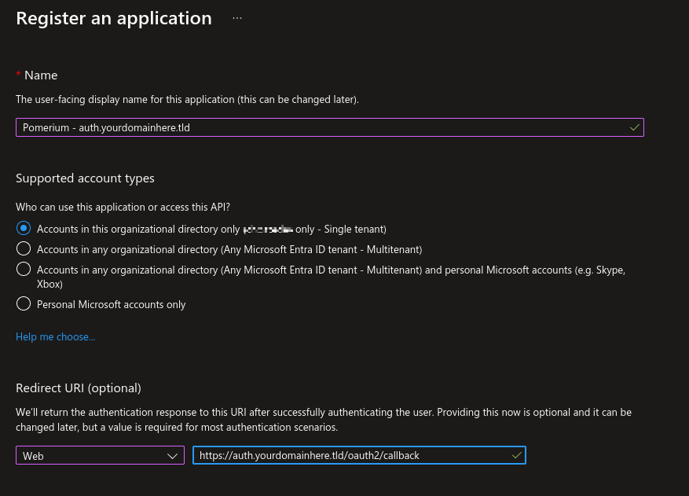
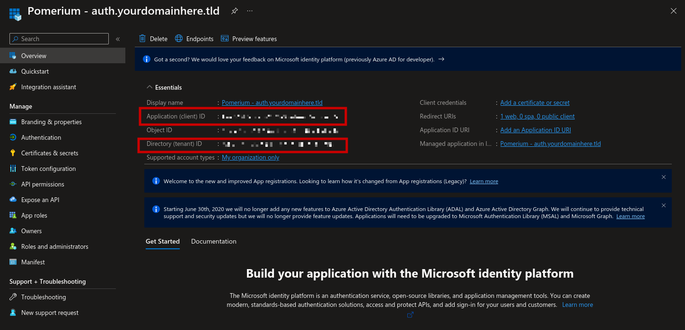
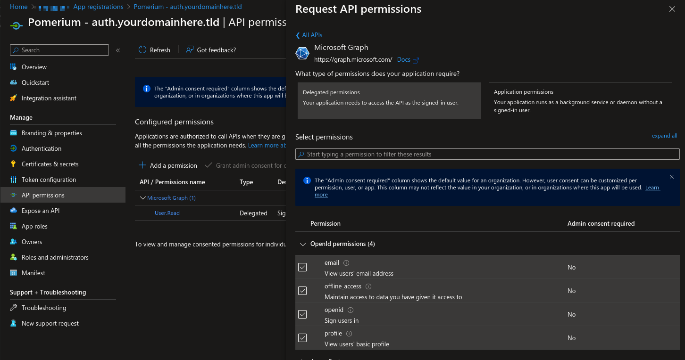
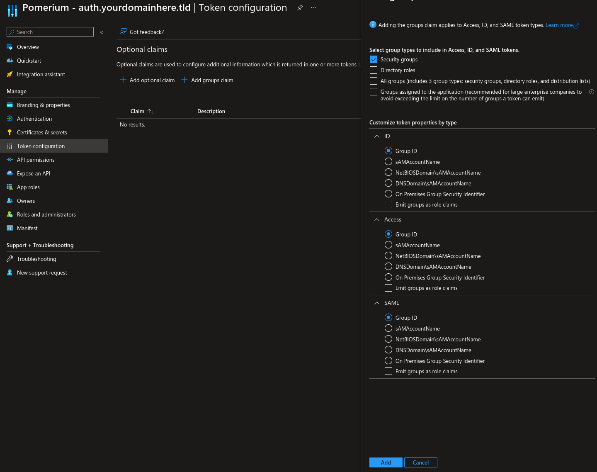

# Pomerium with JWT and Azure AD

This guide is a quick demonstration of getting Pomerium working with Azure AD.

### Assumptions
- Publicly accessible machine with Docker and Docker Compose installed
- Machine is reachable with 2 addresses (auth.whatever.tld and verify.whatever.tld)
- Access to an Azure AD tenant to create an app registration

1. Clone this repository to the server: `git clone https://github.com/zchoate/pomerium-poc.git`
2. Create the prerequisite directories within the directory newly created by git:
    ```bash
    cd pomerium-poc
    mkdir -p pomerium/data/jwks pomerium/data/le
    ```
    These directories will store the JWT signing key that we'll create in the next step and the LetsEncrypt certificates, respectively.
3. Create the key that will be used to sign the JWT tokens:
    ```bash
    openssl genrsa -out ./pomerium/data/jwks/jwks.pem 4096
    ```
    This will create an RSA private key that will be used to sign the JWTs. Protect this as it is a private key.
4. Create a copy of `pomerium.env.example` as `pomerium.env`.
5. Create a cookie secret that is at least 32 characters long using this command:
    ```bash
    head -c32 /dev/urandom | base64
    ```
    Update the `pomerium.env` file with this `COOKIE_SECRET`. We'll come back to `pomerium.env` to update it with additional values.
6. In the meantime, create a file at `./pomerium/config.yaml`. This will store our routes and policies for Pomerium.
    ```yaml
    routes:
      - from: https://verify.<replace with domain>
        to: http://verify:8000
        policy:
          - allow:
              and:
                - claim/groups: '<replace with group guid>'
        pass_identity_headers: true
    ```
    If you don't have the group GUID, that's fine, just come back and edit once you've got that setup.
7. Navigate to Azure AD and create a new App Registration.
8. Go through the *Register an application* wizard.
    - Create a name for the application (this is primarily for your own identification).
    - Maintain the defautl of `Accounts in this organizational directory only` for who can use the application.
    - Choose *Web* for the *Redirect URI* and input the Pomerium redirect URL: `https://auth.<replace with domain>/oauth2/callback`
    </br></br>
9. Note the *Application (client) ID* and *Directory (tenant) ID*. These will be used in `pomerium.env` for `IDP_CLIENT_ID` and replace the section *"replacewithtenantid"* in the `IDP_PROVIDER_URL`. </br></br>
10. Create a *New client secret* under *Certificates & secrets*. Note this and update the associated `IDP_CLIENT_SECRET` value in `pomerium.env`.
11. Navigate to API Permissions and add the following permissions beyond the default `User.Read`: 
    - Delegated > OpenID > email
    - Delegated > OpenID > offline_access
    - Delegated > OpenID > openid
    - Delegated > OpenID > profile
    </br></br>
    
12. We'll enable groups to be transmitted with the claim. To keep it simple we'll use the default group object ID, but you have additional options on how to transmit the group data such as sAMAccountName. Navigate to *Token configuration* and select *Add groups claim* under *Optional claims*. </br></br>